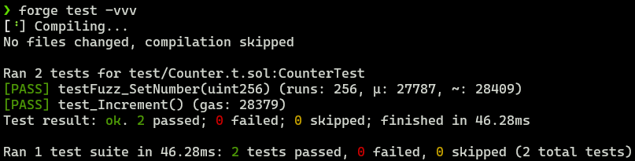
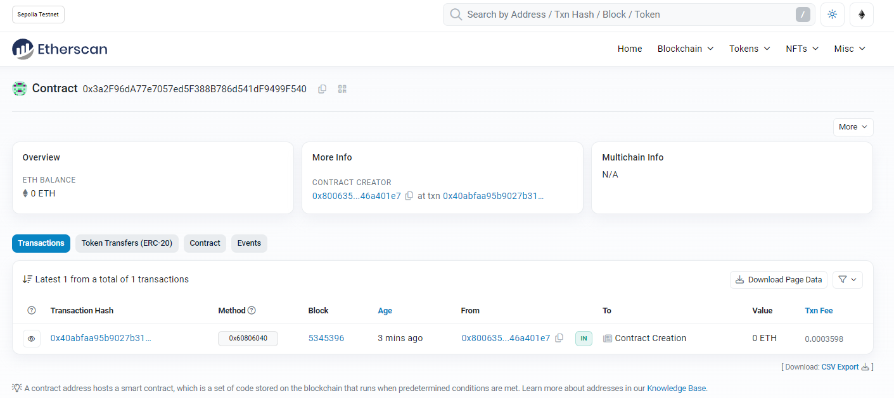

# 2024-Spring-HW0

All the detailed specified in Homework 0 documentation.

## Wallet Address
Please provide your MetaMask wallet address: `0x8006358618B65523f5E79C77149Fcba146a401e7`

## Local Testing
Please provide a screenshot of the `forge test -vvv` command running in your local environment.

## Contract Address
Please provide the contract address that you deployed on the Sepolia network.
`0x3a2F96dA77e7057ed5F388B786d541dF9499F540`

## Sepolia Etherscan
Paste the contract address into the Sepolia Etherscan and share the screenshot.

